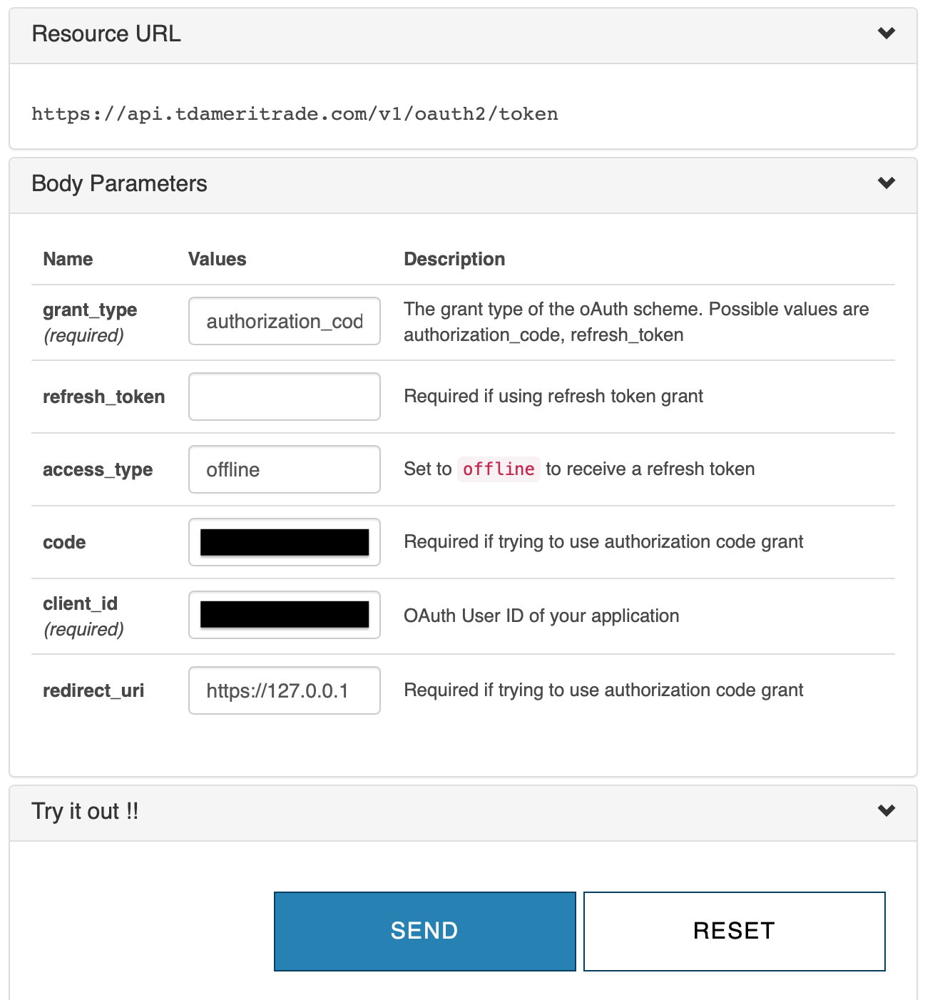

# TDAmeritrade API Authentication

The purpose of this project is to document the TDAmeritrade authorization process, based on OAuth2, so that an application written in Python may access its APIs.

The project includes a write-up (this document) and sample script that will demonstrate how this is done. Note that I will not be using a redirect URL, and will be scraping the Authorization Code from the Login response.

## Basis for this documentation
TDAmeritrade documents the authorization process in their developer website.

These are the most useful links, and this documentation was based on these:

https://developer.tdameritrade.com/content/phase-1-authentication-update-xml-based-api

https://developer.tdameritrade.com/content/simple-auth-local-apps

# Prerequisites
* Python 3.x (latest version)
* A valid TDAmeritrade brokerage account

# Create a TDAmeritrade Developer Account
You may register for a developer account here:
https://developer.tdameritrade.com

Your developer account is unrelated to your brokerage account. The specific applications that are registered within will need to to be authorized to your brokerage account using the same credentials you use to login to the site.

# Register an Application
Once you create a developer account you will need to register a new application.


Fill in the form and note the callback URL. For this demonstration I will set it to ```https://127.0.0.1```

Once you submit the form, note the value of the ```Consumer Key``` which is also referred to as the ```Client ID```

# Generate an Authorization Code
Next, you need to generate an Authorization Code by authenticating with TDAmeritrade using you broker credentials.

## Construct the Login URL
The authentication URL will follow this pattern:

```
https://auth.tdameritrade.com/auth?response_type=code&redirect_uri={URLENCODED REDIRECT URI}&client_id={URLENCODED Consumer Key}%40AMER.OAUTHAP
```
Where:
* ```redirect_uri``` is the URL where your Access Token will be sent. We will not use a redirect for this exercise, and so it must set it to the same redirect value of the registered app.
* ```client_id``` is the consumer key from your registered application.

So for example, if the ```redirect_uri``` is set to **https://127.0.0.1** and ```client_id``` is set to **MYCONSUMERKEY**, the URL would look like this:

```
https://auth.tdameritrade.com/auth?response_type=code&redirect_uri=https%3A%2F%2F127.0.0.1&client_id=MYCONSUMERKEY%40AMER.OAUTHAP
```

## Go through the Authentication flow
Next, login to TDAmeritrade using the URL you just constructed and using your brokerage credentials. This will link your application to your brokerage account and return an Authorization Code.


Complete the login process, which may include a second factor of authentication, and a confirmation that your app may access your brokerage account.

Once complete, the redirect will fail (assuming nothing is listening on localhost), but you will be presented with the Authorization Code, which is embedded in the URL. Make a note of it.


Also note that the authorization token is URL encoded. You must decode it before using it in the next step.

# Generate an Access Token and Refresh Token
Once you URL-decode you Authorization Code, you may request an initial pair of access and refresh tokens. The Access Token is very short lived (30 min), and can be used to access the protected resources in question, namely the TD APIs. Your Refresh Token, on the other hand is used to generate new Access Tokens and is longer lived, typically 3 months. You want to save the Refresh Token. Without it, you will not be able to authenticate your app.

Note that this step could be fully automated since it’s just a normal API call. For this demonstration it is being done manually, since Authorization Codes can only be used once before they become invalid.

To generate these, navigate to the following URL:

https://developer.tdameritrade.com/authentication/apis/post/token-0

and supply these parameters:

* ```grant_type```: authorization_code
* ```access_type```: offline
* ```code```: The Authorization Code from the previous step
* ```client_id```: {Consumer Key} (e.g. MYCONSUMERKEY. don't include the "@AMER.OAUTHAP" suffix)
* ```redirect_uri```: {REDIRECT URI} (e.g. https://127.0.0.1)





# Save the artifacts
Your application is now authorized. The artifacts you must save are:

* The Client ID (the Consumer ID)
* The Refresh Token. You will need this to generate Access Tokens and interact with the TD APIs

The Client ID never expires and is tied to your application, while the Refresh Token will be valid for 3 months, after which you must repeat the authorization process outlined in this document.

# Run the sample script
Given the inputs, the script will generate an authentication code and use it to display the account info by calling this API

```
https://api.tdameritrade.com/v1/accounts/{MYACCOUNT}
```

```
>>python td_api_auth.py -h
usage: td_api_auth.py [-h] -client_id CLIENT_ID -refresh_token REFRESH_TOKEN
                      -account_id ACCOUNT_ID

A Demonstraton of the TDAmeritrade APIs, Specifically this shows how to
generate an Access Token and use it to call an API

optional arguments:
  -h, --help            show this help message and exit
  -client_id CLIENT_ID  The Client ID (Consumer Key) of the registed
                        application
  -refresh_token REFRESH_TOKEN
                        The Refresh Token generated using the login process
  -account_id ACCOUNT_ID
                        The TDAmeritrade brokerage account ID
```

For example:

```
python td_api_auth.py -account_id TDACCOUNTID -client_id MYCLIENTID -refresh_token MYREFRESHTOKEN
```

The output will display the details of the account.

```
[INFO] - Generated Access Token
[INFO] - Displaying Account Info
[INFO] - {
    "securitiesAccount": {
        "type": "CASH",
        "accountId": "TDACCOUNTID",
        "roundTrips": 0,
        "isDayTrader": false,
        "isClosingOnlyRestricted": false,
        "positions": [
            {
                "shortQuantity": 0.0,
                "averagePrice": 1.0,
                "currentDayProfitLoss": 0.0,
                "currentDayProfitLossPercentage": 0.0,
                "longQuantity": 100,
                "settledLongQuantity": 100,
                "settledShortQuantity": 0.0,
                "instrument": {
                    "assetType": "CASH_EQUIVALENT",
                    "cusip": "xxx",
                    "symbol": "xxx",
                    "description": "FDIC INSURED DEPOSIT ACCOUNT  CORE  NOT COVERED BY SIPC",
                    "type": "MONEY_MARKET_FUND"
                },
                "marketValue": 100,
                "maintenanceRequirement": 0.0
            },
            {
                ...
            }
        ],
        "initialBalances": {
            ...
        },
        "currentBalances": {
            ...
        },
        "projectedBalances": {
            ...
        }
    }
}
```
